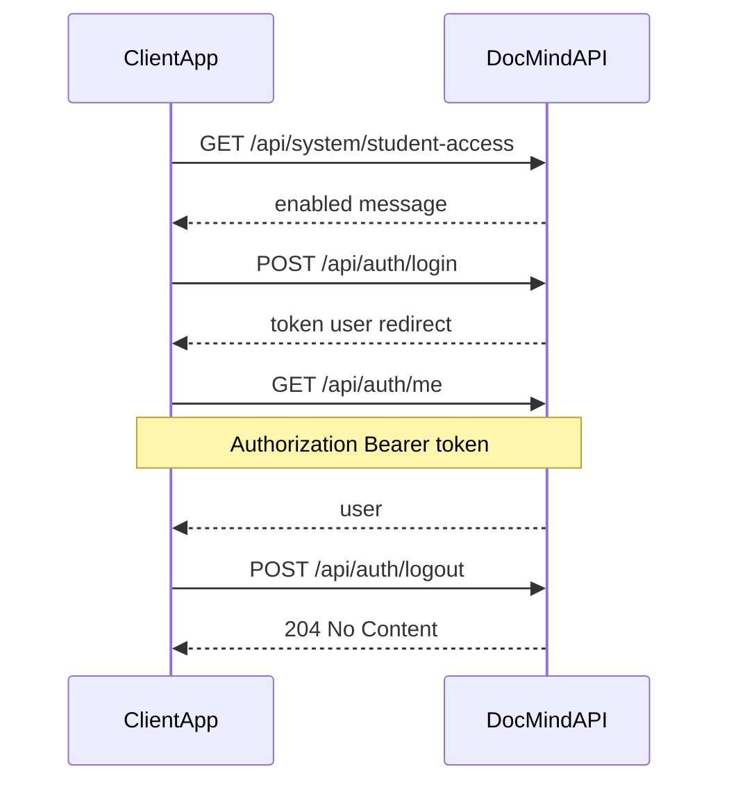

# DocMind API — client specification

This document describes the **product HTTP API** for web and mobile clients. It is derived from the FastAPI routes and Pydantic schemas in this repository.

**Base paths**

| Surface | Prefix | Notes |
| --- | --- | --- |
| Health | `{origin}/health` | No `/api` prefix |
| DocMind API | `{origin}/api` | All routes below assume this prefix unless stated |

Replace `{origin}` with your deployment URL (e.g. `https://api.example.com`).

**OpenAPI and interactive docs**

- Machine-readable schema: `{origin}/openapi.json`
- Swagger UI: `{origin}/docs`

The generated OpenAPI document may still list internal legacy operations under `/api/v1/*` (tags such as `internal`, `legacy`). **Production clients must not call those paths.** They are intentionally omitted from this specification.

---

## 1. Base URL and discovery

- **REST base:** `{origin}/api`
- **Health:** `{origin}/health`
- **OpenAPI JSON:** `{origin}/openapi.json` (codegen; filter out `legacy`/`internal` operations if your toolchain imports everything)
- **Swagger UI:** `{origin}/docs`

---

## 2. Global HTTP conventions

### 2.1 Content type

- Default request/response bodies: **JSON** with `Content-Type: application/json`.
- **Multipart** is required for file uploads (materials, document-chat creation, adding files to a doc conversation). See [section 16](#16-multipart-uploads-examples).

### 2.2 Authentication

Protected routes expect:

```http
Authorization: Bearer <access_token>
```

- Missing header, wrong scheme, invalid/expired JWT, revoked token (after logout), or disabled user → **401** with error envelope `code: UNAUTHENTICATED` (see [section 4](#4-error-model)).
- Valid token but wrong role or missing permission → **403** with `code: FORBIDDEN` or `code: STUDENT_ACCESS_DISABLED` where applicable.

**Public routes** (no `Authorization` required): `GET /health`, `GET /api/system/student-access`, `POST /api/auth/login`.

### 2.3 CORS

Configured server-side (`CORS_ORIGINS` in environment). The app allows:

- Methods: `*`
- Headers: includes `Authorization`, `Content-Type`, `X-Request-Id`
- Exposed response headers: `X-Request-Id`

### 2.4 Request correlation

- Clients may send `X-Request-Id` (any string); if omitted, the server generates one.
- Every response includes `X-Request-Id` echoing the value used for that request (useful for support and logging).

### 2.5 Pagination

Many list endpoints return a **page envelope** (`Page[T]`):

| Query parameter | Type | Constraints | Description |
| --- | --- | --- | --- |
| `page` | integer | ≥ 1 | Page index (1-based) |
| `pageSize` | integer | See below | Page size |
| `sort` | string | optional | Opaque sort key (server-defined) |
| `search` | string | optional | Free-text search where supported |

**`pageSize` limits**

- Student-facing paginated chat lists: **1–100** (default 20).
- Admin list endpoints (`/api/admin/users`, `/api/admin/subjects`, `/api/admin/subjects/stats`, `/api/admin/feedback`): **1–1000** (default 20).

**Response shape**

```json
{
  "items": [ /* T */ ],
  "page": 1,
  "pageSize": 20,
  "total": 42,
  "totalPages": 3
}
```

### 2.6 Date and time

Datetime fields are serialized in **ISO-8601** (UTC with `Z` or offset, depending on server serialization). Examples: `UserResponse.registeredAt`, chat `createdAt`, feedback `timestamp`.

### 2.7 Identifiers and path parameters

Path parameters such as `{subject_id}`, `{conv_id}`, `{user_id}` are **opaque strings** returned by the API. Do not assume a specific format beyond what the backend returns.

---

## 3. JWT access token

Issued by `POST /api/auth/login`. Decoded payload (for client awareness; **verify only on the server** in normal apps — clients typically store the string as-is):

| Claim | Description |
| --- | --- |
| `sub` | User id |
| `role` | One of `student`, `instructor`, `admin` |
| `iat` | Issued-at (Unix seconds) |
| `exp` | Expiry (Unix seconds) |
| `jti` | Unique token id (used for revocation on logout) |

Default lifetime: **720 minutes (12 hours)** from `JWT_EXPIRE_MINUTES` (configurable on the server).

Algorithm (server): `HS256` by default.

---

## 4. Error model

All structured error responses use this JSON body:

```json
{
  "code": "ERROR_CODE",
  "message": "Human-readable message.",
  "details": { }
}
```

- `details` is omitted when empty.
- **400** validation failures (`RequestValidationError`): `code` is `VALIDATION_ERROR`, `message` is typically `"Request body failed validation."`, and `details.errors` contains the FastAPI/Pydantic error list.

### 4.1 Error codes (`code` field)

| Value | Typical HTTP | Meaning |
| --- | --- | --- |
| `VALIDATION_ERROR` | 400 | Body/query validation failed |
| `UNAUTHENTICATED` | 401 | Invalid credentials, missing/invalid token, revoked token, disabled account |
| `FORBIDDEN` | 403 | Authenticated but not allowed for this resource/action |
| `STUDENT_ACCESS_DISABLED` | 403 | Global student-access flag is off (login or student-gated routes) |
| `NOT_FOUND` | 404 | Resource does not exist or is not visible |
| `CONFLICT` | 409 | State conflict (duplicate name, cannot remove last file, etc.) |
| `FILE_TOO_LARGE` | 413 | Upload exceeds configured max size |
| `UNSUPPORTED_MEDIA_TYPE` | 415 | File MIME/extension not allowed |
| `UNPROCESSABLE` | 422 | Empty file or similar |
| `FILE_UNSAFE` | varies | Unsafe file (if raised) |
| `FILE_ENCRYPTED` | 422 | Encrypted PDF not supported |
| `FILE_LIMIT` | 409 | Too many document-chat attachments |
| `FILES_NOT_READY` | 409 | Doc chat: files still processing |
| `SUBJECT_NOT_READY` | 409 | Tutor chat: subject has no processed materials |
| `CANNOT_DISABLE_SELF` | varies | Admin self-disable guard (if raised) |
| `RATE_LIMITED` | 429 | Rate limited (if enforced) |
| `INTERNAL_ERROR` | 500 | Unexpected server error |

**401 vs 403**

- Authentication problems → **401** + `UNAUTHENTICATED`.
- Valid session but wrong role or policy (e.g. not enrolled, not instructor on subject) → **403** + `FORBIDDEN` (or `STUDENT_ACCESS_DISABLED` for the global student gate).

---

## 5. Auth and session

### 5.1 `POST /api/auth/login`

**Auth:** none.

**Request body**

| Field | Type | Constraints |
| --- | --- | --- |
| `username` | string | 1–64 chars |
| `password` | string | 1–128 chars |

**Response 200** (`LoginResponse`)

| Field | Type | Description |
| --- | --- | --- |
| `token` | string | JWT access token |
| `user` | object | See `UserSummary` in [section 10.1](#101-common-objects) |
| `redirect` | string | Suggested post-login path: `/home` (student), `/instructor`, `/admin` |
| `welcomeMessage` | string \| null | Optional greeting |

**Errors**

- Wrong password / unknown user / disabled user → **401** `UNAUTHENTICATED` (generic message: `"Invalid username or password."` where applicable).
- Student login when global access disabled → **403** `STUDENT_ACCESS_DISABLED`.

### 5.2 `POST /api/auth/logout`

**Auth:** Bearer (required).

**Response:** **204 No Content** (no body). Revokes the current token’s `jti`.

### 5.3 `GET /api/auth/me`

**Auth:** Bearer.

**Response 200** (`MeResponse`)

| Field | Type |
| --- | --- |
| `user` | `UserSummary` (see [10.1](#101-common-objects)) |

---

## 6. System — student access

### 6.1 `GET /api/system/student-access`

**Auth:** none (public; used before login to show banners).

**Response 200** (`StudentAccessResponse`)

| Field | Type | Description |
| --- | --- | --- |
| `enabled` | boolean | Whether students may use student-gated features |
| `message` | string | Admin message (may be empty) |
| `updatedAt` | string (datetime) \| null | Last update time |

### 6.2 `PATCH /api/admin/system/student-access`

**Auth:** Bearer, role **admin**.

**Request body** (`UpdateStudentAccessRequest`)

| Field | Type | Constraints |
| --- | --- | --- |
| `enabled` | boolean | required |
| `message` | string \| null | optional, max 500; empty string clears stored message |

**Response 200:** same shape as `StudentAccessResponse`.

---

## 7. Subjects and semesters

**Student access gate:** routes that depend on `require_student_access` require the student-access flag to be **on** for **students** only. Instructors and admins are unaffected.

**Subject access gate:** routes with `require_subject_access` require the caller to be **admin**, or **instructor on the subject roster**, or **enrolled student** on that subject. Non-existent subject → **404** `NOT_FOUND`.

### 7.1 `GET /api/subjects/student`

**Auth:** Bearer. **Role:** student. **Gate:** student access enabled.

**Response 200:** JSON array of `SubjectResponse`.

### 7.2 `GET /api/subjects/instructor`

**Auth:** Bearer. **Role:** instructor or admin.

**Query**

| Name | Type | Description |
| --- | --- | --- |
| `instructorId` | string, optional | When caller is admin, filter by this instructor’s subjects |

**Response 200:** JSON array of `SubjectResponse`.

### 7.3 `GET /api/subjects/{subject_id}`

**Auth:** Bearer. **Gate:** `require_subject_access` (student access for students + enrollment/roster).

**Response 200:** `SubjectResponse`.

### 7.4 `GET /api/subjects/{subject_id}/instructors`

**Auth:** Bearer. **Gate:** `require_subject_access`.

**Response 200:** JSON array of `InstructorResponse`.

### 7.5 `GET /api/subjects/{subject_id}/students`

**Auth:** Bearer. **Role:** admin or instructor.

- Instructor must be assigned to the subject; otherwise **403** `FORBIDDEN`.

**Response 200:** JSON array of `StudentResponse`.

### 7.6 `GET /api/semesters`

**Auth:** Bearer (any authenticated user).

**Response 200:** JSON array of `SemesterResponse`.

### 7.7 Admin subjects — `GET /api/admin/subjects`

**Auth:** Bearer. **Role:** admin.

**Query:** standard admin pagination (`page`, `pageSize`, `sort`, `search`) + optional `semesterId` (string).

**Response 200:** `Page[SubjectResponse]`.

### 7.8 `POST /api/admin/subjects`

**Auth:** Bearer. **Role:** admin.

**Request body** (`CreateSubjectRequest`)

| Field | Type | Constraints |
| --- | --- | --- |
| `id` | string | 2–64 chars; must match `^[a-z0-9-]{2,64}$` |
| `title` | string | 1–120 |
| `description` | string | 1–500 |
| `courseCode` | string | 1–80 |
| `semesterId` | string \| null | max 64 |
| `instructorIds` | string[] | default `[]` |
| `studentIds` | string[] | default `[]` |

**Response 201:** `SubjectResponse`.

### 7.9 `PATCH /api/admin/subjects/{subject_id}`

**Auth:** Bearer. **Role:** admin.

**Request body** (`UpdateSubjectRequest`) — all optional:

| Field | Type | Constraints |
| --- | --- | --- |
| `title` | string | 1–120 |
| `description` | string | 1–500 |
| `courseCode` | string | 1–80 |
| `semesterId` | string \| null | max 64 |
| `instructorIds` | string[] \| null | |
| `studentIds` | string[] \| null | |

**Response 200:** `SubjectResponse`.

### 7.10 `DELETE /api/admin/subjects/{subject_id}`

**Auth:** Bearer. **Role:** admin.

**Response 204:** no body.

---

## 8. Materials (`/api/subjects/{subject_id}/materials`)

### 8.1 `GET /api/subjects/{subject_id}/materials`

**Auth:** Bearer. **Role:** instructor or admin.

**Response 200:** JSON array of `MaterialResponse`.

### 8.2 `POST /api/subjects/{subject_id}/materials`

**Auth:** Bearer. **Role:** instructor only (admins receive **403** if they call this route).

**Content-Type:** `multipart/form-data`.

**Parts**

| Name | Type | Required | Description |
| --- | --- | --- | --- |
| `file` | file | yes | Upload body |
| `name` | string | no | Display name override |

**Allowed types**

- Extensions: **`.pdf`**, **`.pptx`**
- MIME types: `application/pdf`, `application/vnd.openxmlformats-officedocument.presentationml.presentation`

**Size:** per-server `UPLOAD_MATERIAL_MAX_MB` (default **50** MiB). Oversize may return **413** `FILE_TOO_LARGE` when `UploadFile.size` is known; otherwise enforced during processing.

**Other errors**

- **415** `UNSUPPORTED_MEDIA_TYPE` — wrong type
- **422** `FILE_ENCRYPTED` — encrypted PDF
- **409** `CONFLICT` — duplicate material name in subject

**Response 201:** `MaterialResponse` with `status` often `indexing` until background indexing completes (`processed`).

### 8.3 `PATCH /api/subjects/{subject_id}/materials/{material_id}`

**Auth:** Bearer. **Role:** instructor or admin.

**Request body** (`UpdateMaterialRequest`)

| Field | Type | Description |
| --- | --- | --- |
| `name` | string, optional | 1–255 |
| `status` | string, optional | `indexing` or `processed` |

**Response 200:** `MaterialResponse`.

### 8.4 `DELETE /api/subjects/{subject_id}/materials/{material_id}`

**Auth:** Bearer. **Role:** instructor or admin.

**Response 204:** no body.

---

## 9. Tutor chat (`/api/chat/tutor`)

**Auth:** Bearer. **Role:** student. **Gate:** student access enabled.

### 9.1 `POST /api/chat/tutor/conversations`

**Request body** (`CreateTutorConversationRequest`)

| Field | Type |
| --- | --- |
| `subjectId` | string |

**Errors**

- Subject missing → **404**
- Student not enrolled → **403**
- No processed materials on subject → **409** `SUBJECT_NOT_READY`

**Response 201:** `ConversationResponse`.

### 9.2 `GET /api/chat/tutor/conversations`

**Query:** pagination + optional `subjectId` (filter).

**Response 200:** `Page[ConversationResponse]`.

### 9.3 `GET /api/chat/tutor/conversations/{conv_id}/messages`

**Query:** pagination.

**Response 200:** `Page[MessageResponse]`.

### 9.4 `DELETE /api/chat/tutor/conversations/{conv_id}`

**Response 204:** no body.

### 9.5 `POST /api/chat/tutor/conversations/{conv_id}/messages`

**Request body** (`SendMessageRequest`)

| Field | Type | Constraints |
| --- | --- | --- |
| `message` | string | 1–4000 chars |

**Errors**

- Empty message (whitespace) → **400** `VALIDATION_ERROR`
- **409** `SUBJECT_NOT_READY` if subject has no processed materials

**Response 200:** `ChatReplyResponse` (assistant reply role is `assistant`).

### 9.6 Compat — `POST /api/chat/tutor/{subject_id}`

Same auth and gates as tutor chat.

**Request body:** `SendMessageRequest`.

**Response 200** (`LegacyReplyResponse`)

| Field | Type |
| --- | --- |
| `reply` | string |

---

## 10. Data models (JSON)

### 10.1 Common objects

**`UserSummary`** (auth responses)

| Field | Type |
| --- | --- |
| `id` | string |
| `username` | string |
| `name` | string |
| `role` | `student` \| `instructor` \| `admin` |

**`SubjectResponse`**

| Field | Type | Notes |
| --- | --- | --- |
| `id` | string | |
| `title` | string | |
| `description` | string | |
| `courseCode` | string | |
| `semesterId` | string \| null | |
| `pdfCount` | string | Pre-formatted display string |
| `instructorIds` | string[] | |
| `studentIds` | string[] | default `[]` |
| `studentCount` | number | |

**`InstructorResponse`**

| Field | Type |
| --- | --- |
| `id` | string |
| `username` | string |
| `name` | string |
| `email` | string |

**`StudentResponse`**

| Field | Type |
| --- | --- |
| `id` | string |
| `name` | string |
| `email` | string |

**`SemesterResponse`**

| Field | Type |
| --- | --- |
| `id` | string |
| `label` | string |

**`MaterialResponse`**

| Field | Type |
| --- | --- |
| `id` | string |
| `name` | string |
| `size` | string | Human-readable |
| `date` | string | Human-readable |
| `status` | `indexing` \| `processed` |
| `uploadedById` | string |
| `uploadedByName` | string |
| `uploadedByInitials` | string \| null |
| `sizeBytes` | number \| null |

**`ConversationResponse`**

| Field | Type |
| --- | --- |
| `id` | string |
| `title` | string |
| `subjectId` | string \| null | Tutor: set; doc chat: often null |
| `createdAt` | string (datetime) |
| `updatedAt` | string (datetime) |
| `messageCount` | number |

**`MessageResponse`**

| Field | Type |
| --- | --- |
| `id` | string |
| `role` | `user` \| `assistant` \| `doc` |
| `text` | string |
| `createdAt` | string (datetime) |

**`ChatReplyResponse`**

| Field | Type |
| --- | --- |
| `userMessage` | `MessageResponse` |
| `reply` | `MessageResponse` |

**`DocumentFileResponse`**

| Field | Type |
| --- | --- |
| `id` | string |
| `name` | string |
| `status` | `processing` \| `ready` |
| `sizeBytes` | number |
| `mime` | string |

**`CreateDocConversationResponse`**

| Field | Type |
| --- | --- |
| `conversation` | `ConversationResponse` |
| `files` | `DocumentFileResponse[]` |

**`FeedbackRequest` / `FeedbackResponse`**

Request:

| Field | Type |
| --- | --- |
| `feedback` | `up` \| `down` |

Response adds:

| Field | Type |
| --- | --- |
| `id` | string |
| `messageId` | string |
| `createdAt` | string (datetime) |

### 10.2 Admin — users

**`UserResponse`**

| Field | Type |
| --- | --- |
| `id` | string |
| `username` | string |
| `name` | string |
| `email` | string |
| `role` | `student` \| `instructor` \| `admin` |
| `status` | `active` \| `disabled` |
| `registeredAt` | string (datetime) |
| `lastActive` | string (datetime) \| null |

**`CreateUserRequest`**

| Field | Type | Constraints |
| --- | --- | --- |
| `username` | string | 1–64 |
| `name` | string | 1–120 |
| `email` | string | Valid email |
| `role` | enum | `student` \| `instructor` \| `admin` |
| `password` | string | 8–128 |
| `enrolledSubjectIds` | string[] \| null | optional |

**`UpdateUserRequest`** (all optional)

| Field | Type | Constraints |
| --- | --- | --- |
| `name` | string | 1–120 |
| `email` | string | valid email |
| `role` | enum | |
| `enrolledSubjectIds` | string[] \| null | |

**`ToggleStatusRequest`**

| Field | Type |
| --- | --- |
| `status` | `active` \| `disabled` |

**`ResetPasswordResponse`**

| Field | Type |
| --- | --- |
| `temporaryPassword` | string |

**`UserSubjectsRequest`**

| Field | Type |
| --- | --- |
| `subjectIds` | string[] (default `[]`) |

### 10.3 Admin — analytics types

**`SubjectStatsResponse`**

| Field | Type |
| --- | --- |
| `id` | string |
| `title` | string |
| `semester` | string \| null |
| `pdfCount` | number |
| `materialStatus` | `indexing` \| `processed` \| `mixed` \| `empty` |
| `interactions` | number |
| `aiResponses` | number |
| `thumbsUp` | number |
| `thumbsDown` | number |
| `instructorIds` | string[] |

**`FeedbackRowResponse`**

| Field | Type |
| --- | --- |
| `id` | string |
| `student` | string |
| `studentId` | string |
| `subject` | string |
| `subjectId` | string |
| `semester` | string \| null |
| `question` | string |
| `aiResponse` | string |
| `feedback` | `up` \| `down` |
| `timestamp` | string (datetime) |

**`ActivityResponse`**

| Field | Type |
| --- | --- |
| `id` | string |
| `action` | string |
| `user` | string \| null |
| `time` | string (datetime) |

**`DailyUsageResponse`**

| Field | Type |
| --- | --- |
| `day` | string (date `YYYY-MM-DD`) |
| `conversations` | number |
| `questions` | number |

---

## 11. Document chat (`/api/chat/doc`)

**Auth:** Bearer. **Role:** student. **Gate:** student access enabled.

**Upload policy (document files)**

- Extensions: **`.pdf`**, **`.pptx`**, **`.png`**
- MIME: `application/pdf`, `application/vnd.openxmlformats-officedocument.presentationml.presentation`, `image/png`
- Max size per file: `UPLOAD_DOC_MAX_MB` (default **25** MiB) → **413** `FILE_TOO_LARGE`
- Max files per conversation: `UPLOAD_DOC_MAX_FILES` (default **5**) → **409** `FILE_LIMIT`

### 11.1 `POST /api/chat/doc/conversations`

**Content-Type:** `multipart/form-data`.

**Parts:** one or more file parts named **`files`** (required list).

**Errors**

- No files → **400** `VALIDATION_ERROR`
- Too many files → **409** `FILE_LIMIT`
- Wrong MIME/extension → **415** `UNSUPPORTED_MEDIA_TYPE`
- Encrypted PDF → **422** `FILE_ENCRYPTED`

**Response 201:** `CreateDocConversationResponse`.

### 11.2 `GET /api/chat/doc/conversations`

**Query:** pagination.

**Response 200:** `Page[ConversationResponse]`.

### 11.3 `GET /api/chat/doc/conversations/{conv_id}/messages`

**Query:** pagination.

**Response 200:** `Page[MessageResponse]` (assistant role may be `doc`).

### 11.4 `DELETE /api/chat/doc/conversations/{conv_id}`

Deletes conversation, files on disk, and associated vector collection.

**Response 204:** no body.

### 11.5 `POST /api/chat/doc/conversations/{conv_id}/files`

**Content-Type:** `multipart/form-data`.

**Parts:** `file` (single file).

**Response 201:** `DocumentFileResponse`.

### 11.6 `GET /api/chat/doc/conversations/{conv_id}/files`

**Response 200:** JSON array of `DocumentFileResponse`.

### 11.7 `DELETE /api/chat/doc/conversations/{conv_id}/files/{file_id}`

Cannot remove the last file → **409** `CONFLICT`.

**Response 204:** no body.

### 11.8 `POST /api/chat/doc/conversations/{conv_id}/messages`

**Request body:** `SendMessageRequest`.

**Errors**

- Any attached file still `processing` → **409** `FILES_NOT_READY`
- Empty message → **400** `VALIDATION_ERROR`

**Response 200:** `ChatReplyResponse`.

### 11.9 Compat — `POST /api/chat/doc`

**Request body:** `SendMessageRequest`.

**Response 200:** `LegacyReplyResponse` (`reply` string). Stateless / ad-hoc behavior on the server (no persistent conversation in this path).

---

## 12. Message feedback

### 12.1 `POST /api/chat/messages/{message_id}/feedback`

**Auth:** Bearer. **Role:** student. **Gate:** student access.

**Request body:** `FeedbackRequest`.

**Response 200:** `FeedbackResponse` (upsert semantics).

### 12.2 `DELETE /api/chat/messages/{message_id}/feedback`

**Response 204:** no body.

---

## 13. Admin dashboard

All routes: **Auth:** Bearer, **Role:** **admin**.

### 13.1 Users

| Method | Path | Description |
| --- | --- | --- |
| GET | `/api/admin/users` | Paginated list; query `role` optional: `student` \| `instructor` \| `admin` |
| GET | `/api/admin/users/{user_id}` | User detail |
| POST | `/api/admin/users` | Create (`CreateUserRequest`) → **201** `UserResponse` |
| PATCH | `/api/admin/users/{user_id}` | Update (`UpdateUserRequest`) |
| PATCH | `/api/admin/users/{user_id}/status` | Toggle (`ToggleStatusRequest`) |
| POST | `/api/admin/users/{user_id}/reset-password` | Returns `ResetPasswordResponse` |
| DELETE | `/api/admin/users/{user_id}` | **204** |
| GET | `/api/admin/users/{user_id}/subjects` | `SubjectResponse[]` |
| PUT | `/api/admin/users/{user_id}/subjects` | Body `UserSubjectsRequest`; returns `SubjectResponse[]` |

Admin list endpoints use admin pagination (`pageSize` up to **1000**).

### 13.2 `GET /api/admin/subjects/stats`

**Query:** admin pagination.

**Response 200:** `Page[SubjectStatsResponse]`.

### 13.3 `GET /api/admin/feedback`

**Query:** admin pagination + optional filters:

| Name | Type | Description |
| --- | --- | --- |
| `semester` | string | optional |
| `subjectId` | string | optional |
| `feedback` | string | optional: `up` or `down` |

**Response 200:** `Page[FeedbackRowResponse]`.

### 13.4 `GET /api/admin/activity`

**Query**

| Name | Type | Default | Range |
| --- | --- | --- | --- |
| `limit` | integer | 20 | 1–100 |

**Response 200:** JSON array of `ActivityResponse`.

### 13.5 `GET /api/admin/analytics/daily`

**Query**

| Name | Type | Default | Range |
| --- | --- | --- | --- |
| `days` | integer | 14 | 1–90 |

**Response 200:** JSON array of `DailyUsageResponse`.

---

## 14. Health

### `GET /health`

**Auth:** none.

**Response 200**

| Field | Type | Description |
| --- | --- | --- |
| `status` | string | e.g. `"ok"` |
| `uptimeSec` | integer | Server uptime seconds |
| `version` | string | Application version from config |

---

## 15. Role × endpoint matrix

Legend: **A** = admin, **I** = instructor, **S** = student, **·** = not applicable / denied by design.

| Endpoint | Public | Student | Instructor | Admin |
| --- | --- | --- | --- | --- |
| `GET /health` | Yes | Yes | Yes | Yes |
| `GET /api/system/student-access` | Yes | Yes | Yes | Yes |
| `POST /api/auth/login` | Yes | Yes | Yes | Yes |
| `POST /api/auth/logout` | · | Yes | Yes | Yes |
| `GET /api/auth/me` | · | Yes | Yes | Yes |
| `PATCH /api/admin/system/student-access` | · | · | · | Yes |
| `GET /api/subjects/student` | · | Yes* | · | · |
| `GET /api/subjects/instructor` | · | · | Yes | Yes |
| `GET /api/subjects/{id}` | · | Yes*† | Yes*† | Yes*† |
| `GET /api/subjects/{id}/instructors` | · | Yes*† | Yes*† | Yes*† |
| `GET /api/subjects/{id}/students` | · | · | Yes‡ | Yes |
| `GET /api/semesters` | · | Yes | Yes | Yes |
| Admin subjects CRUD | · | · | · | Yes |
| `GET /api/subjects/{id}/materials` | · | · | Yes | Yes |
| `POST /api/subjects/{id}/materials` | · | · | Yes | · |
| `PATCH/DELETE .../materials/...` | · | · | Yes | Yes |
| Tutor + doc chat + feedback | · | Yes* | · | · |
| `POST /api/chat/tutor/{subject_id}` compat | · | Yes* | · | · |
| `POST /api/chat/doc` compat | · | Yes* | · | · |
| `/api/admin/*` (except PATCH student-access above) | · | · | · | Yes |

\*Student routes also require the global **student access** flag for students.

†Subject roster / enrollment gate (admins bypass enrollment).

‡Instructor must be on the subject’s instructor roster.

---

## 16. Multipart uploads (examples)

Replace `{origin}`, `{token}`, ids, and file paths. Use real line endings; `\` is shell continuation.

### 16.1 Instructor material upload

```bash
curl -X POST "{origin}/api/subjects/{subject_id}/materials" \
  -H "Authorization: Bearer {token}" \
  -H "X-Request-Id: optional-correlation-id" \
  -F "file=@/path/to/slides.pptx" \
  -F "name=Week 3 slides"
```

### 16.2 Document chat — create conversation with files

Field name must be **`files`** for each part (FastAPI `List[UploadFile] = File(...)`).

```bash
curl -X POST "{origin}/api/chat/doc/conversations" \
  -H "Authorization: Bearer {token}" \
  -F "files=@/path/to/notes.pdf" \
  -F "files=@/path/to/diagram.png"
```

### 16.3 Document chat — add file to existing conversation

```bash
curl -X POST "{origin}/api/chat/doc/conversations/{conv_id}/files" \
  -H "Authorization: Bearer {token}" \
  -F "file=@/path/to/extra.pdf"
```

---

## 17. Auth flow (diagram)



---

## 18. Endpoint index (quick reference)

| Method | Path |
| --- | --- |
| GET | `/health` |
| POST | `/api/auth/login` |
| POST | `/api/auth/logout` |
| GET | `/api/auth/me` |
| GET | `/api/system/student-access` |
| PATCH | `/api/admin/system/student-access` |
| GET | `/api/subjects/student` |
| GET | `/api/subjects/instructor` |
| GET | `/api/subjects/{subject_id}` |
| GET | `/api/subjects/{subject_id}/instructors` |
| GET | `/api/subjects/{subject_id}/students` |
| GET | `/api/semesters` |
| GET | `/api/admin/subjects` |
| POST | `/api/admin/subjects` |
| PATCH | `/api/admin/subjects/{subject_id}` |
| DELETE | `/api/admin/subjects/{subject_id}` |
| GET | `/api/subjects/{subject_id}/materials` |
| POST | `/api/subjects/{subject_id}/materials` |
| PATCH | `/api/subjects/{subject_id}/materials/{material_id}` |
| DELETE | `/api/subjects/{subject_id}/materials/{material_id}` |
| POST | `/api/chat/tutor/conversations` |
| GET | `/api/chat/tutor/conversations` |
| GET | `/api/chat/tutor/conversations/{conv_id}/messages` |
| DELETE | `/api/chat/tutor/conversations/{conv_id}` |
| POST | `/api/chat/tutor/conversations/{conv_id}/messages` |
| POST | `/api/chat/tutor/{subject_id}` |
| POST | `/api/chat/doc/conversations` |
| GET | `/api/chat/doc/conversations` |
| GET | `/api/chat/doc/conversations/{conv_id}/messages` |
| DELETE | `/api/chat/doc/conversations/{conv_id}` |
| POST | `/api/chat/doc/conversations/{conv_id}/files` |
| GET | `/api/chat/doc/conversations/{conv_id}/files` |
| DELETE | `/api/chat/doc/conversations/{conv_id}/files/{file_id}` |
| POST | `/api/chat/doc/conversations/{conv_id}/messages` |
| POST | `/api/chat/doc` |
| POST | `/api/chat/messages/{message_id}/feedback` |
| DELETE | `/api/chat/messages/{message_id}/feedback` |
| GET | `/api/admin/users` |
| GET | `/api/admin/users/{user_id}` |
| POST | `/api/admin/users` |
| PATCH | `/api/admin/users/{user_id}` |
| PATCH | `/api/admin/users/{user_id}/status` |
| POST | `/api/admin/users/{user_id}/reset-password` |
| DELETE | `/api/admin/users/{user_id}` |
| GET | `/api/admin/users/{user_id}/subjects` |
| PUT | `/api/admin/users/{user_id}/subjects` |
| GET | `/api/admin/subjects/stats` |
| GET | `/api/admin/feedback` |
| GET | `/api/admin/activity` |
| GET | `/api/admin/analytics/daily` |

---

*This file is the hand-authored client contract for product surfaces. For code-to-router mapping, see [`api_map.md`](api_map.md).*
